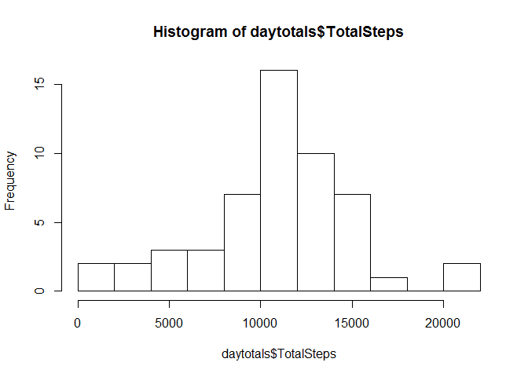
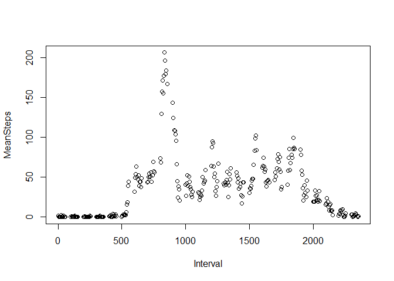
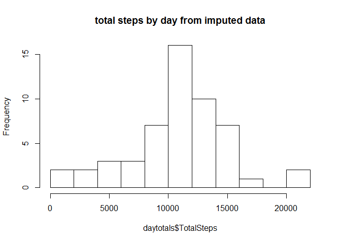
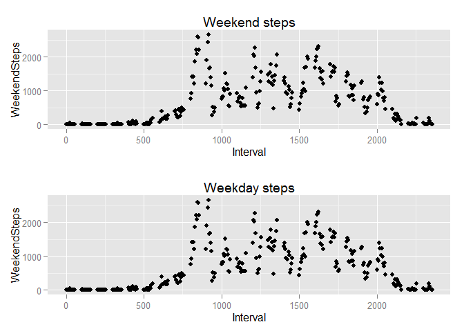

# Peer Assessment 1
Bob Carasik  
Saturday, May 09, 2015  

In the first R code chunk, I load libraries, set the directory,  load the dataset,
and clean the data by preparing a dataset with null data omitted:

## Loading and preprocessing the data


## What is mean total number of steps taken per day?
Here, I create the plot for the first question and create a histogram of steps per day.  I count the number of days for each range of total steps taken. I then report the mean and median of the total number of steps taken per day.

 

```
##  mean steps per day from raw data  10766.19  median steps per day  10765
```


## What is the average daily activity pattern?

The second part of the assignment is the average daily activity pattern
I created a time series plot of the 5-minute intervals on the x-axis and the average number of steps taken, averaged across all days on the y-axis.

I then identify the 5-minute interval that contains the maximum number of steps on average across all the days in the dataset. 
 

```
##  The interval with the most steps is  835
```

## Imputing missing values

I next create a copy of the raw data set with values imputed where the steps data is absent.  I simply assign the mean number of steps for a given interval when there is no steps data for an interval for a day in the dataset.  I then re-calculate mean and median steps per day where the missing values have been imputed

 

```
##  mean steps per day from imputed data  10766.19  median steps per day  10765
```
## Are there differences in activity patterns between weekdays and weekends?

Now I add a "weekdays" factor to the imputed data, and I make two plots for steps by interval for weekends and weekdays

 
 
